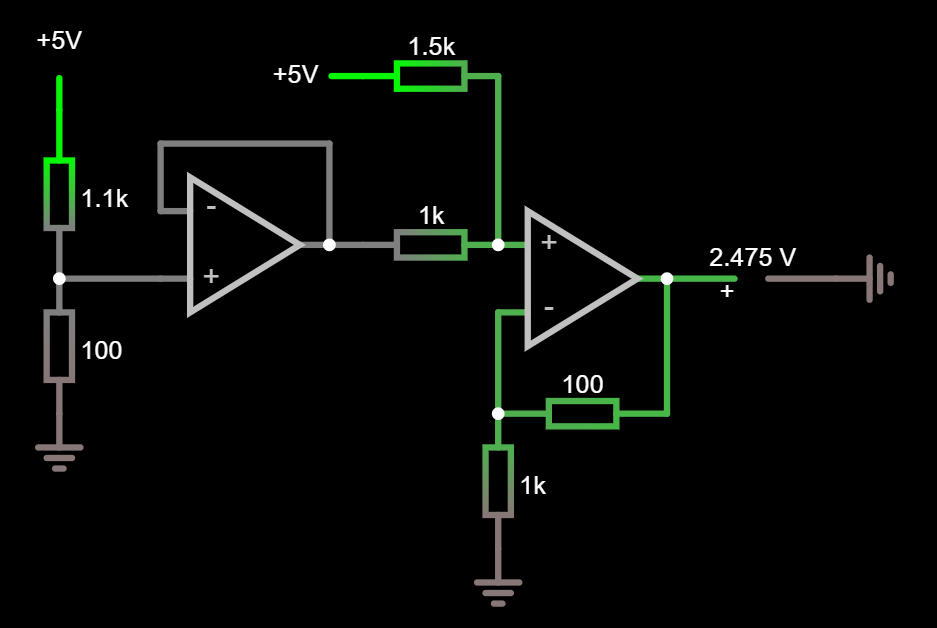
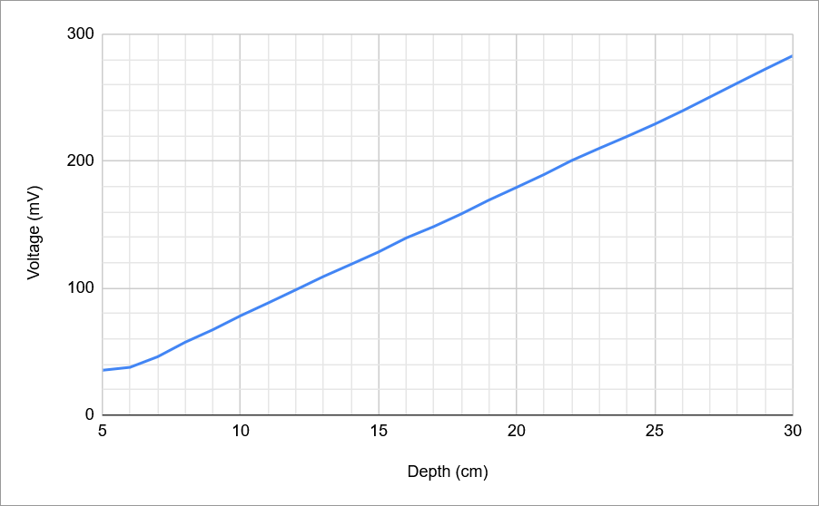
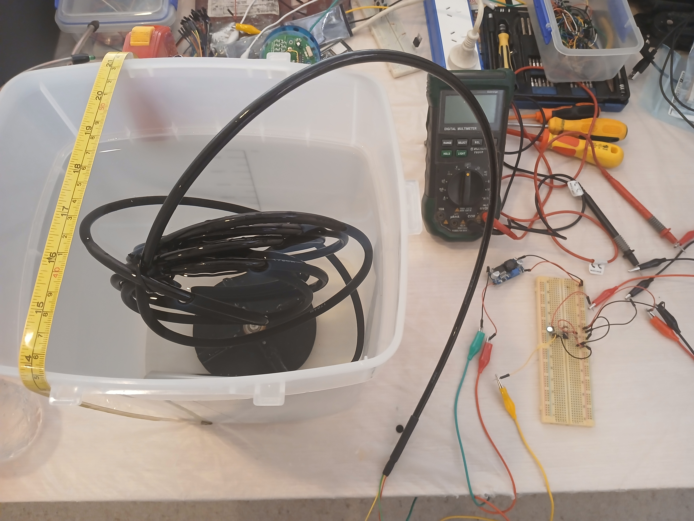

# Development Notes

This document covers the development history of the Depth Monitor project — what was attempted, what failed, and what was learned. The README covers what the project *is*; this covers how it got there.

---

## Background

About four years ago, I worked at a hydroponic herb farm harvesting mint, basil, coriander, and similar crops at scale. One of the ongoing pain points for the owners was manually monitoring the pH and nutrient concentration (electrical conductivity) of their irrigation tanks — the ones that weren't already automated. Having recently graduated with a Bachelor of Engineering in Electrical and Electronics, I wanted to put that to use.

I started with the basics: a device to measure pH and EC. ESP32 as the controller — I was already familiar with it. From there, the scope exploded.

Water depth would be useful too. Temperature is easy, might as well add it. The tanks are far from power points, so solar + LiPo. WiFi is unreliable out there, so LoRa. That needs a base station. The readings need to go somewhere, so a PostgreSQL database on a local server. And a web frontend to display them. And so on.

I bought a pressure/depth sensor, pH sensor, and temperature probe from AliExpress. Then, somewhere in the middle of trying to figure out the final form factor and waterproofing, I burnt out. The parts went into the cupboard for the next three years.

---

## Reviving It as an MVP

When I came back to the project, I made a deliberate decision to strip it down to its minimum viable form. The pH sensor had expired — the 3M KCl storage solution had long since crystallised. The pressure sensor was more interesting than the temperature probe, so I built a focused mini-project around it.

The goal was simple:

1. ESP32 reads voltage from the pressure sensor
2. Converts it to a depth in cm
3. Posts the measurement to New Relic
4. New Relic sends an email alert if the depth goes above or below a threshold

No LoRa. No database. No frontend. Just a sensor, a microcontroller, and an API.

---

## Initial Sensor Testing

I started with a variable voltage DC bench supply set to 24VDC (the sensor's rated supply voltage), and a multimeter on the signal wire. Test container: a tub from a resin print cleaner, filled with water.

Sensor in the water — voltage goes up. Sensor out of the water — voltage goes down. Good start.

---

## The ADC Problem

Next, I connected the sensor signal wire directly to GPIO 33 on the ESP32 (ADC1 Channel 5) and started reading with `analogReadMilliVolts()`. With the sensor fully submerged in 30cm of water, readings were stable. But as I lifted the sensor toward the surface, readings became erratic — deviating by ±10mV between samples.

The ESP32 ADC has defined input voltage ranges depending on attenuation setting:

| Attenuation | Measurable range |
|---|---|
| ADC_ATTEN_DB_0 | 100 mV – 950 mV |
| ADC_ATTEN_DB_2_5 | 100 mV – 1250 mV |
| ADC_ATTEN_DB_6 | 150 mV – 1750 mV |
| ADC_ATTEN_DB_11 | 150 mV – 2450 mV |

At low depth, the sensor output voltage was falling below the stable input range. Even adding a bypass capacitor in parallel with the ADC pin and averaging 16 samples wasn't enough to stabilise the readings below this threshold.

---

## The Op-Amp Rabbit Hole

The sensor is rated for 0–5V output across its full 0–5m range. My test tub only went to ~30cm, so the sensor was operating at the very bottom of its output range — well below the ESP32 ADC's reliable window.

My first thought: use an op-amp to bring the signal into range. Specifically, a non-inverting summing amplifier: add a small DC offset voltage (to lift the signal off the bottom) and attenuate it to fit within the ADC window. I designed this in [CircuitJS](https://falstad.com/circuit/circuitjs.html?ctz=DwYwlgTgBAZgvAIgIwKgFwM6IAwDpsEECsqYIiSeATAVQOx0DM2AHFQGwCcndqIARoiLZUAB0EJhqAG4QhqALaYhAUwC0SFAD4AUFCjAAhlAAeiFgBYWUTkio2q121VTwELRYflQFYHKgBzL2RCAgQAel19I1MKAidHKEoWBI9YRE5Pb19-KCC40Iiog2gzdwIHaxYK7hd0hBEoORCRSL0S2PLsSqhq7ss0t0bmzTC26IDOvptOe2nKVld-cYMAdymaxIHKpYai9uB1su2WTnZeq172C13W4sOpy5Zrnueb+ruDo4ytl9mnOy3fbRb4If42Ow2CwWCF1IbAjplTjQ2FJeKwoFNAqfaKlDIoliMewLKpEzEjYQ4tadEmo2mEuHLe6iGmsVJJJDsVK7FA+FS5DDkPZNfl7FbASZlTRcnqaSw7D4I4B4lpOWZolIzRnCkZje4q2m1NGsNFEdjk7FKyUFayUM3G23YOjaqkPKXoo2G6FA8Wg5Jq4lshXw8UAJU6yJhDNRDMxq3hPkMJmk8jDG36TwqLE5cYTCiTKckSsMABMAFZQUU0VAqPzClQAO0QADUAPYAGzQhgCKkUTeFCjKJCgGDQLY7XZ7+2A4XAEF0QA), an online circuit simulator.

The circuit used an LM358N (a dual op-amp DIP IC designed for single-supply operation) and a voltage divider bringing 5V down to ~0.2V to act as the offset. On paper, this would shift the output range to approximately 275mV–2475mV — well within ADC_6db.

I breadboarded it and tested it. The output voltage didn't change regardless of sensor depth.

What followed was a series of configuration attempts trying to diagnose why:

- Added a voltage follower between the sensor wire and the summing amplifier — no change
- Added a voltage follower between the voltage divider and the summing amplifier — no change
- Tried various other op-amp configurations

Eventually I worked out a few things that were all true simultaneously:
- The sensor output voltage at low depth was so small, and the sensor's output impedance high enough, that the circuit wasn't loading it correctly
- Voltage followers break down when the input voltage is near the op-amp's supply rail limits (the LM358 has a minimum input of ~0V but a headroom requirement near the upper rail)
- The ESP32's ADC is genuinely not well suited to low-voltage signals — Vref varies ±~10% between chips, the characteristic curve is nonlinear at the extremes, and it doesn't behave well below its rated input floor

If I return to this project to expand on it, I would ditch op-amps entirely and go straight to th ADS1115 ADC — it has a programmable gain amplifier, stable readings down to ±0.256V full-scale, and communicates over I2C. At 50mV sensor output the readings stabilise well.

---

## Calibration Experiment

At some point I realised I'd been assuming a linear response across the full sensor range without ever actually verifying it. I emptied the tub, positioned the sensor vertically, and did a proper characterisation: add 1cm of water, record the voltage, repeat up to 30cm.

| Depth (cm) | Voltage (mV) |
|---|---|
| 5 | 35.3 |
| 6 | 37.6 |
| 7 | 45.9 |
| 8 | 57.4 |
| 9 | 67.2 |
| 10 | 78.2 |
| 11 | 88.3 |
| 12 | 98.6 |
| 13 | 109.1 |
| 14 | 118.7 |
| 15 | 128.5 |
| 16 | 139.5 |
| 17 | 148.5 |
| 18 | 158.5 |
| 19 | 169.4 |
| 20 | 179.4 |
| 21 | 189.6 |
| 22 | 200.6 |
| 23 | 210.2 |
| 24 | 219.5 |
| 25 | 229.2 |
| 26 | 239.6 |
| 27 | 250.6 |
| 28 | 261.6 |
| 29 | 272.5 |
| 30 | 283.1 |

The sensor is non-linear for the first ~7cm. Above that, the response is linear at approximately **10.25 mV/cm**.

This experiment also explained a lot of the earlier frustration. Before doing it, I'd taken two-point measurements at "just below" and "just above" the waterline to derive a mV/cm ratio — but these measurements were taken right in the non-linear region. Every time I took a new pair of points, I got a different ratio. That produced inconsistent depth readings, which I spent a lot of time blaming on the sensor being cheap or the circuit being wrong, rather than on my own flawed assumption that the sensor was linear across its full range.

Had I done this experiment first, the op-amp work would have been much shorter, or might not have happened at all — because I would have known earlier that the sensor barely outputs anything in shallow water, and that the right fix is a better ADC rather than signal conditioning.

---

## End-to-End Test

With the calibration done and the ADC limitation understood, I wrapped up the MVP. The test:

1. Filled the tub to 30cm (~283mV — within ADC_6db range)
2. Set up a New Relic alert to send an email when depth exceeded 25cm
3. Submerged the sensor to the bottom of the tub
4. Confirmed the email arrived

Project complete.

---

## What's Next

The MVP is functional but constrained. To make this deployable in a real tank:

- **ADS1115 external ADC** — stable readings across the full sensor output range, removes the ADC floor/ceiling problem entirely
- **Signal conditioning** (if staying with the ESP32 ADC) — a simple voltage divider to scale the 0–5V sensor range into 0–1.75V, plus recalibration
- **Solar + LiPo** — the sensor draws only 2mA at 24V; a boost converter from a LiPo stepped up to 24V, controlled by the ESP32 enable pin, makes fully wireless battery-powered deployment viable
- **Recalibration** — the current constants were derived from a 10–30cm bench test; a real deployment needs calibration across the actual operating range of the tank

---

## Lessons Learned

- **Test the sensor first.** A 30-minute characterisation experiment at the start would have saved several hours of op-amp debugging.
- **Scope creep is a project killer.** The original design (LoRa mesh, solar nodes, database, GUI) never got built. The MVP did.
- **Know your tools' limitations.** The ESP32 ADC is convenient but genuinely bad at low voltages. Knowing this upfront would have pointed toward the ADS1115 immediately.
- **Verify assumptions.** Assuming the sensor was linear across its full range — without checking — led to bad calibration data and a lot of confusion about why the numbers weren't consistent.
