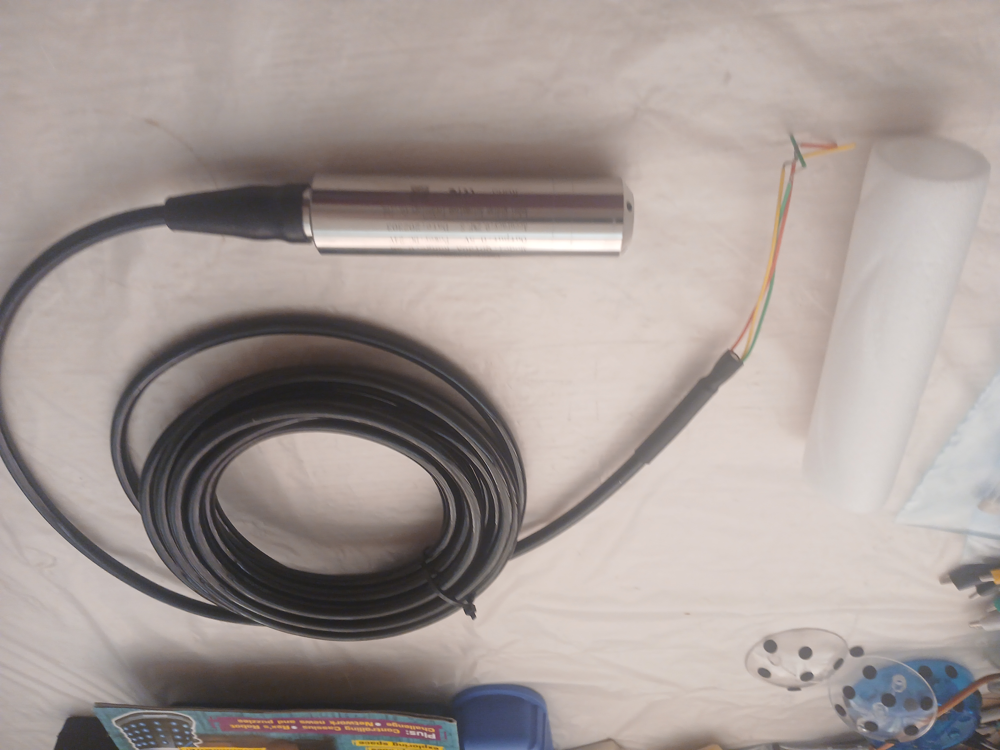
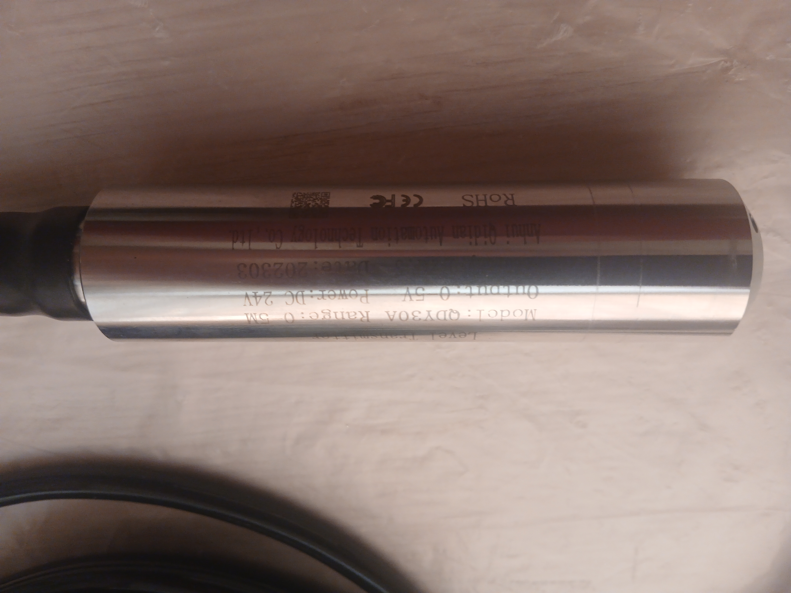
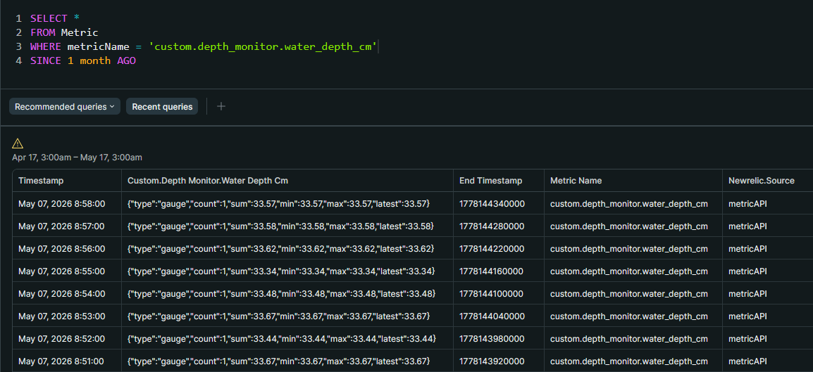
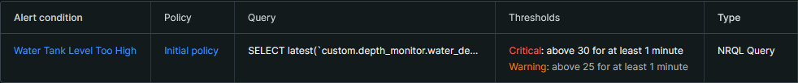

# Depth Monitor

An ESP32-based water depth monitor using a submersible pressure sensor. Measurements are reported to New Relic as a custom metric, with email alerts triggered when the water level goes above or below configurable thresholds.

---

## Hardware

| Component | Details |
|---|---|
| Microcontroller | ESP32 (ESP32-WROOM-32) |
| Depth sensor | QDY30A submersible level transmitter, voltage output (0–5V), 3-wire (Anhui Qidian Automation Technology) |




| Power supply | 24VDC (sensor supply voltage) |

### Wiring

| Sensor wire | Connection |
|---|---|
| Power (red) | 24VDC |
| GND (black) | GND |
| Signal (green) | ESP32 GPIO 33 (ADC) |

The sensor operates on 24VDC and outputs a voltage proportional to water depth. The signal wire connects directly to the ESP32 ADC pin.

---

## Software Setup

### Prerequisites

- [PlatformIO](https://platformio.org/) (VS Code extension or CLI)

### Configuration

Copy `include/config.h.example` to `include/config.h` and fill in your credentials:

```cpp
#define WIFI_SSID       "your_wifi_ssid"
#define WIFI_PASSWORD   "your_wifi_password"
#define NR_LICENSE_KEY  "your_newrelic_ingest_license_key"
```

`include/config.h` is gitignored and will never be committed.

### Build and Flash

```
pio run --target upload
```

---

## Calibration

The sensor is rated for 0–5V output across a 0–5m range. Calibration was performed in a test tub up to 30cm depth.

### Measured Data

| Depth (cm) | Voltage (mV) |
|---|---|
| 5 | 35.3 |
| 10 | 78.2 |
| 15 | 128.5 |
| 20 | 179.4 |
| 25 | 229.2 |
| 30 | 283.1 |

The sensor output is non-linear below approximately 10cm. Above this, the response is linear at roughly **10.25 mV/cm**.


### Constants (in `main.cpp`)

```cpp
const float V_FLOOR_MV = 150.0f;  // ADC_6db lower bound — readings unreliable below this (~17 cm)
const float V_MIN_MV   = -24.25f; // extrapolated voltage at 0 cm depth
const float MV_PER_CM  = 10.25f;  // mV per cm
```

When the ADC reads below `V_FLOOR_MV`, the device reports a depth of 0 cm to New Relic, which will trigger the low-water alert.

### Recalibrating

To recalibrate for a different sensor or deployment:

1. Fill the container to several known depths
2. Record the sensor voltage at each depth
3. Fit a line through the linear region (above the non-linear low-depth zone)
4. Update `V_MIN_MV` (zero intercept) and `MV_PER_CM` (slope) accordingly
5. Set `V_FLOOR_MV` to the ADC attenuation lower bound for your chosen attenuation setting

---

## New Relic Setup

Measurements are posted to the [New Relic Metric API](https://docs.newrelic.com/docs/data-apis/ingest-apis/metric-api/introduction-metric-api/) as a gauge metric: `custom.depth_monitor.water_depth_cm`.



You will need a **New Relic Ingest – License key** (not a user API key). Set this in `config.h`.

The endpoint is configured for the EU region (`metric-api.eu.newrelic.com`). Change to `metric-api.newrelic.com` if you are on a US account.

### Suggested Alert Conditions

| Condition | Threshold | Severity |
|---|---|---|
| Water level too low | < 20 cm | Critical |
| Water level low | < 40 cm | Warning |
| Water level too high | > 180 cm | Critical |

Thresholds should be adjusted for your specific tank and sensor range.



---

## Limitations

- **ADC range constraint:** The ESP32 ADC with `ADC_6db` attenuation accepts 150–1750mV. The sensor is rated for 0–5V output across a 0–5m range, which far exceeds this window. The end-to-end test was deliberately performed at full tub depth (~30cm, ~283mV) to keep the signal within ADC range. A real deployment would require either signal conditioning (e.g. a voltage divider to scale 0–5V into the ADC window) or a dedicated external ADC (e.g. ADS1115), and the calibration constants would need to be rederived against the conditioned signal.
- **Minimum measurable depth:** ~17 cm with the current setup. Depths below this report as 0 and will trigger the low-water alert.
- **Calibration range:** Constants were derived from a 10–30cm test in a small tub, not the full 0–5m sensor range. Recalibrate before deploying in a real tank.
- **TLS:** Certificate validation is disabled (`setInsecure()`). Add a root CA bundle before any production deployment.
